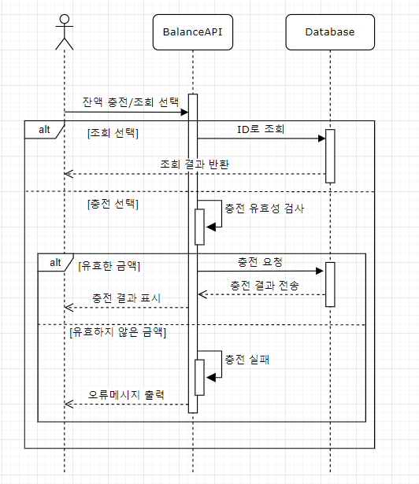
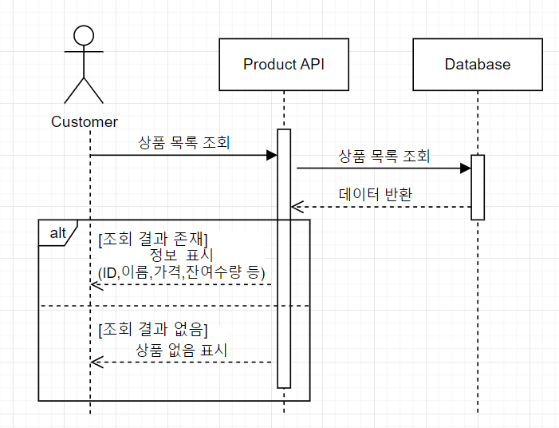
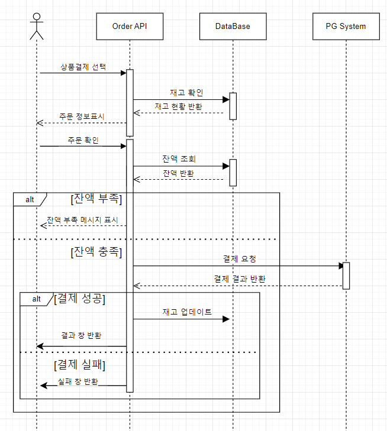
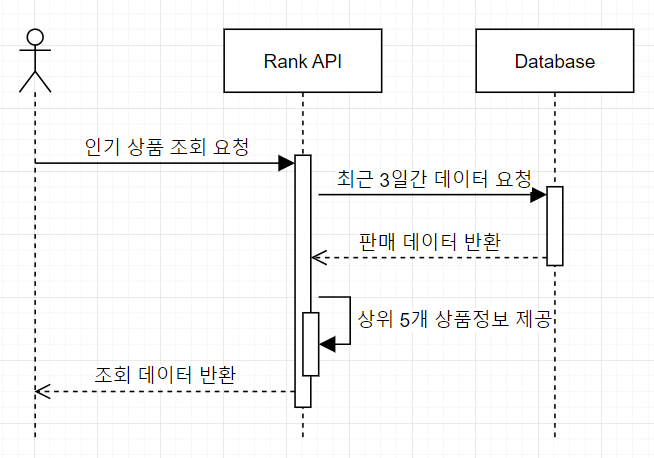
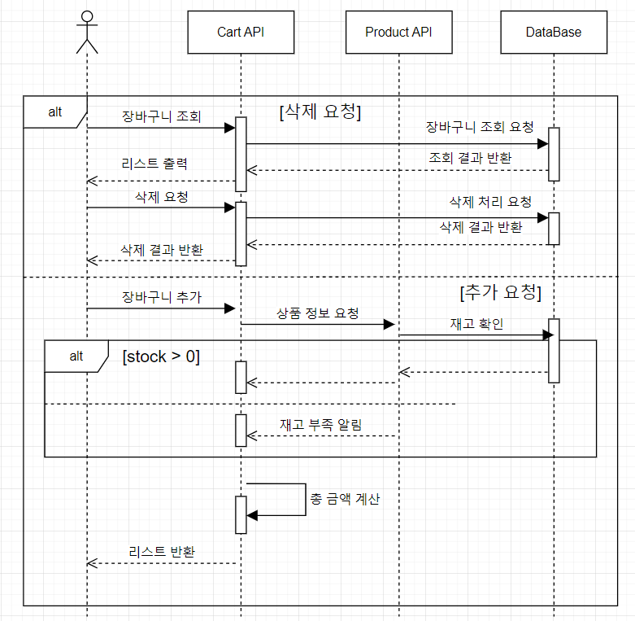

# 🛒 e-commerce service 

## Description 
- `e-커머스 상품 주문 서비스`를 구현해 봅니다.
- 상품 주문에 필요한 메뉴 정보들을 구성하고 조회가 가능해야 합니다.
- 사용자는 상품을 여러개 선택해 주문할 수 있고, 미리 충전한 잔액을 이용합니다.
- 상품 주문 내역을 통해 판매량이 가장 높은 상품을 추천합니다.

## Requirements

- 아래 4가지 API 를 구현합니다.
    - 잔액 충전 / 조회 API
    - 상품 조회 API
    - 주문 / 결제 API
    - 인기 판매 상품 조회 API
- 각 기능 및 제약사항에 대해 단위 테스트를 반드시 하나 이상 작성하도록 합니다.
- 다수의 인스턴스로 어플리케이션이 동작하더라도 기능에 문제가 없도록 작성하도록 합니다.
- 동시성 이슈를 고려하여 구현합니다.
- 재고 관리에 문제 없도록 구현합니다.

## MileStone 
해당 프로젝트의 milestone 입니다. 
👉🏻 https://github.com/users/devNana222/projects/1/views/1

## API 
 ## 1. 잔액 충전/조회 API 

### ✔️ Description
* 고객은 잔액 충전과 조회중 선택하여 System에 요청합니다. 
* 조회 Flow
  * customer_id로 Database에서 조회한 잔액을 반환해줍니다.
* 충전 Flow
  * 유효한 금액(ex - 10단위로 이루어진 양의 정수 && 최대 충전 금액 이하)일 경우 Database에 충전 요청을 합니다.
    * Database에서 충전 결과를 반환해줍니다
    * System은 유저에게 충전 결과를 표시해줍니다.
  * 유효하지 않은 금액(ex - 음수, 소수점 등.. 비즈니스 정책에 맞지 않는 금액)일 경우
    * 충전 실패 오류 메시지를 고객에게 출력합니다. 

> 💸유효한 금액  
> - 10원 단위로 입력 가능함.  
> - 최소 충전 500원 부터 가능.  
> - 최대 충전금액 100000 까지 가능.

## 2. 상품 조회 API 

* 고객은 System에 상품 조회를 요청합니다. 
* DB에서 상품 목록 조회 명령을 내린 후 데이터가 반환됩니다. 
* 결과가 존재하면 ID, 이름, 가격, 잔여 수량 등의 상품 정보리스트가 표시 됩니다. 
* 결과가 없다면 상품 없음이 표시됩니다. 

## 3. 주문/결제 API 

* 고객은 상품결제를 선택합니다. 
* System에서 해당 상품의 재고가 있는지를 판단한 후 결과값을 반환해줍니다. 
* 선택한 상품과 주문 가능상태를 전달 받아 주문 정보를 고객에게 표시해줍니다. 
* 고객의 주문확인이 완료되면 System은 고객의 잔액을 확인합니다.
* 잔액부족 flow
  * 잔액 부족 메시지를 표시합니다. 
* 잔액 충족 flow
  * 외부 결제 시스템에 결제 금액을 요청합니다. 
  * 결제 결과를 외부 결제 시스템에서 반환받습니다.
  * 결제 성공 flow 
    * 주문 수량만큼 재고를 감소시키고 업데이트 합니다. 
    * 주문 결과를 반환합니다. 
  * 결제 실패 flow 
    * 오류메시지와 함께 고객에게 실패 메시지를 반환합니다. 

## 4. 인기 판매 상품 조회 API 

* 고객은 인기 상품 조회를 요청합니다. 
* System은 Database에 최근 3일간의 판매 데이터요청을 합니다.
* Database에서 반환된 데이터 중 상위 5개의 상품 정보를 제공합니다. 
* System에서 제공받은 데이터를 고객에게 반환합니다. 

## 5. 장바구니 API 

* 삭제 flow
  * 고객은 본인의 장바구니를 선택하여 시스템에 조회요청을 합니다.
  * 고객은 장바구니에 있는 상품을 선택하여 삭제 요청을 합니다.
  * 시스템은 삭제 결과를 반환해줍니다. 
  * 
* 추가 flow 
  * 고객은 본인의 장바구니를 선택하여 시스템에 조회요청을 합니다. 
  * System은 Database에 상품 정보를 요청하고 반환된 상품 정보를 반환합니다. 
  * 추가 된 상품 수 만큼 금액을 계산하여 장바구니 리스트를 반환해줍니다. 