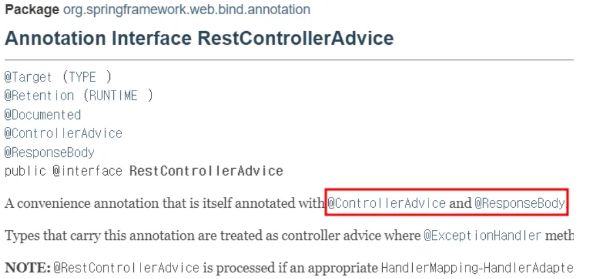

#  @ControllerAdvice & @RestControllerAdvice 
> Spring 3.2, Spring4.3부터 제공하고있는 전역적으로 예외를 처리할 수 있는 기능. 

<code>@RestControllerAdvice</code>는 <code>@ControllerAdvice</code>와 다르게 <code>@ResponseBody</code>가 붙어있어 응답을 *Json*으로 내려준다.

## @ControllerAdvice 
* 여러 컨트롤러에 대해 전역적으로 <code>ExceptionHandler</code>와 <code>@InitBinder</code>를 적용해준다.
> <code>HandlerExceptionResolver</code> 클라이언트의 잘못된 요청이 오면 HttpStatus가 4XX로 반환된다. 
간혹 500서버 에러가 발생하는 경우에는 <code>Dispatcher Servlet</code>이 인터셉터를 통해 preHandler작업 이후 handler adapter에 접근하고 컨트롤러에 접근하면서 **예외를 발견하였지만 예외정보를 전달하지 않고 WAS까지 에러가 없다고 넘어간 경우** 이다. 
>>📒HandlerExceptionResolver가 인터셉터의 postHandle전에 예외를 처리해 준다고 해도 postHandle은 호출되지 않는다.
> 
><code>@ExceptionHandler</code> : HandlerExceptionResolver를 제공해 주며 다른 ExceptionResolver 중에 우선순위를 가장 높게 만들어준다.
><code>@InitBinder</code> : 컨트롤러에서 WebDataBinder를 사용해 커맨드 객체를 바인딩 또는 검증 설정을 변경하는 용도로 사용된다. 
* <code>@Component</code>어노테이션이 있어서 ControllerAdvice가 선언된 클래스는 스프링 빈으로 등록된다. 

◾하나의 클래스로 모든 컨트롤러에 대해 전역적으로 예외처리 가능.  
◾직접 정의한 에러 응답을 일관성 있게 클라이언트에 내려줄 수 있다.  
◾별도의 try-catch문 없어서 코드의 가독성이 높아진다. 

일관된 예외응답을 위해서는 <code>@Order</code>어노테이션으로 순서를 지정해줘야한다. 
- 한 프로젝트당 하나의 ControllAdvice만 관리할 것.
- 여러 ControllerAdvice가 필요하다면 <code>basePackages</code>나 <code>annotations</code>를 지정할 것.
- 직접 구현한 Exception클래스들은 *한 공간에서 관리할 것*

## @RestControllerAdvice 

<code>@Exceptionhandler</code>를 메소드에 선언하고 특정 예외 클래스를 지정해주면 해당 예외가 발생했을 때 메소드에 정의한 로직으로 처리할 수 있다.